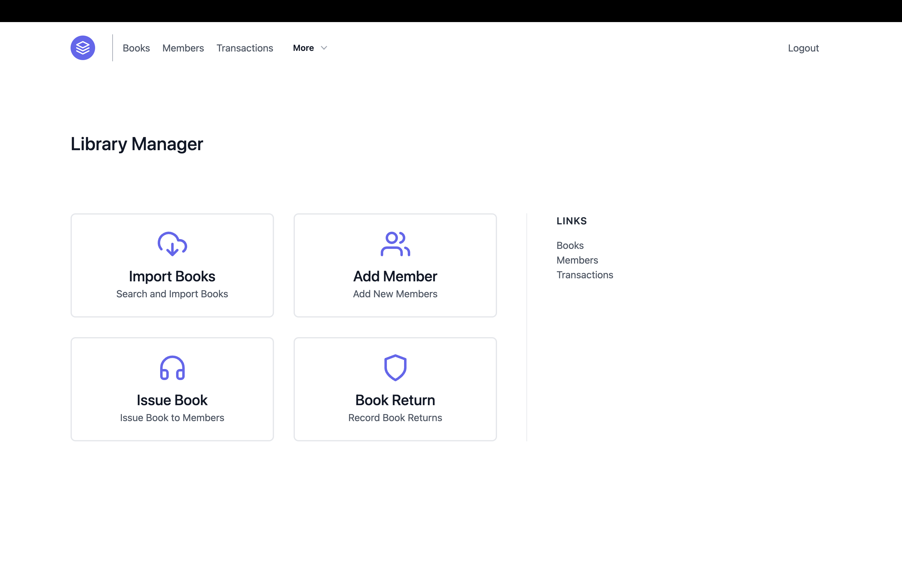
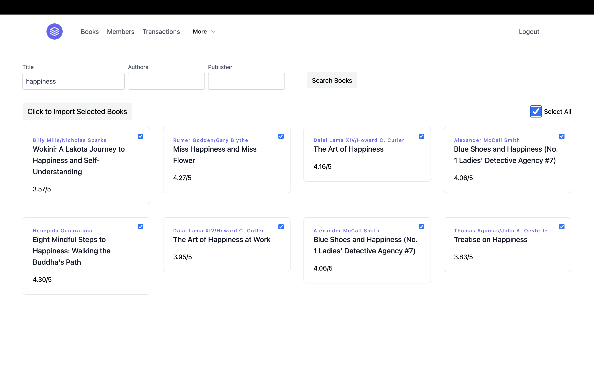
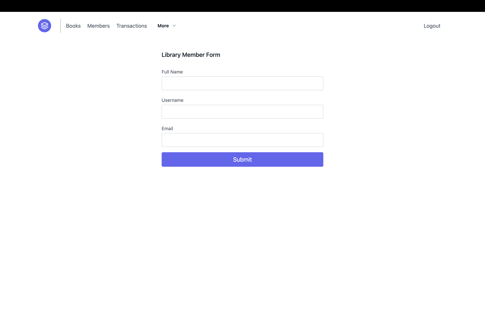
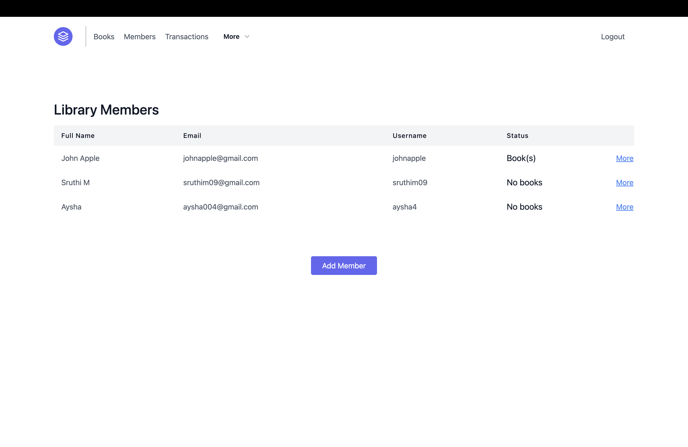
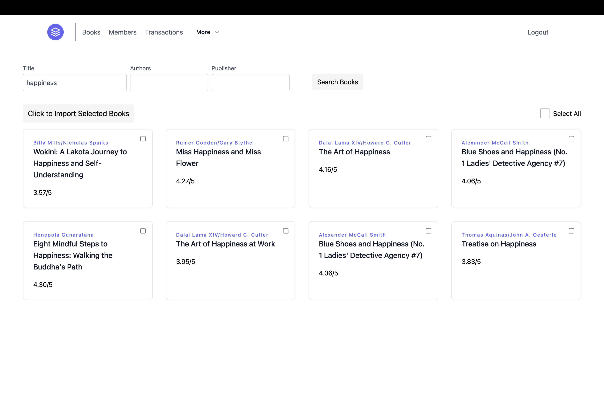
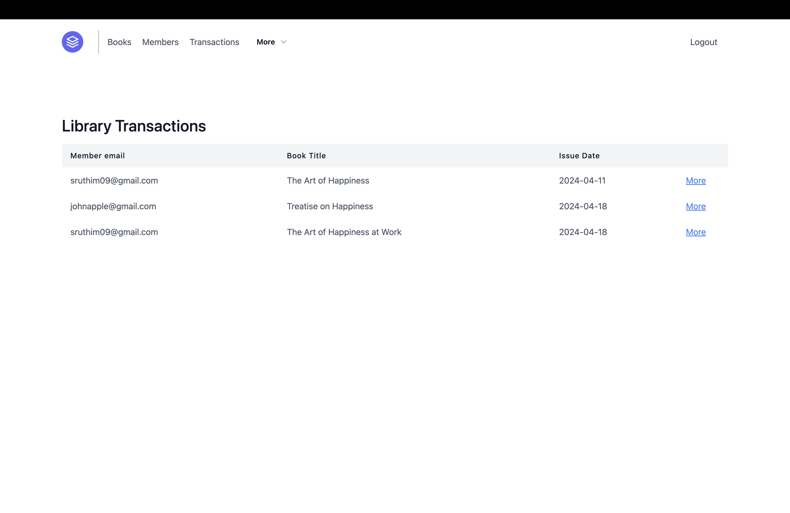
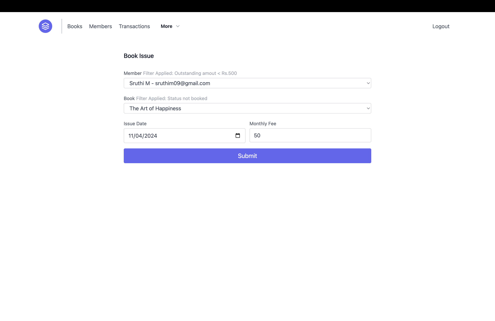
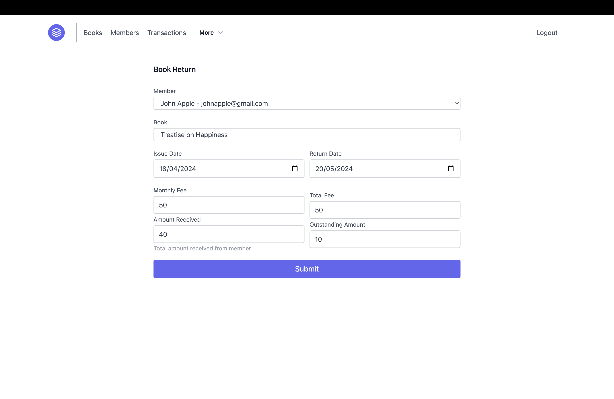
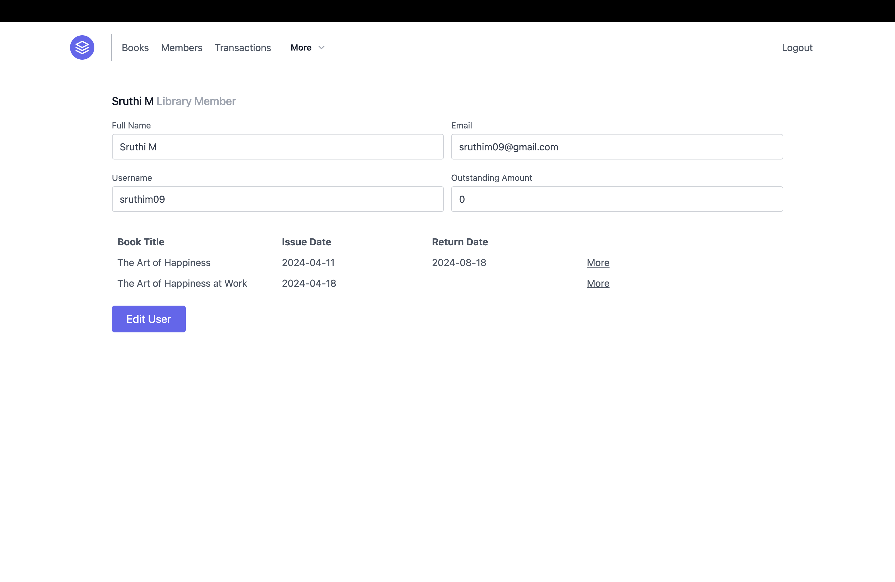
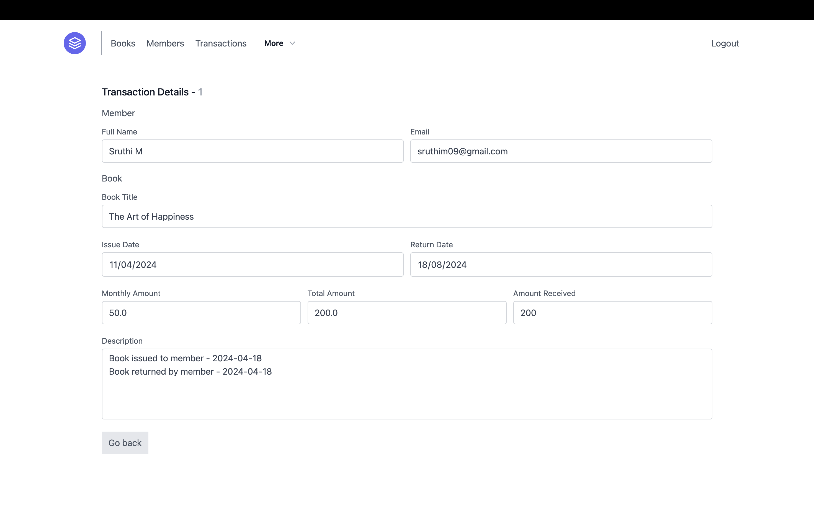

# Library Management System

A web application built on the Flask framework for managing library transactions. This enables librarians to add books and members, record book issues and returns, etc.

## Demo
[Live link](https://library-management-zymq.onrender.com/)

## Screenshots

### Dashboard

### Import books

### Add member

### View members, books, and transactions

### Record book issue and return

### Member details

### Transaction details

